# 项目名
多媒体数据提取及存储技术——云DT猫

## 项目概述

一个安卓app，实现了云DT猫项目的部分功能，能用来识别常见图像的中非结构化数据,例如识别以下图像中的非结构化数据:

1.银行卡和身份证的信息的识别;

2.汽车的品牌和型号的识别;

3.菜品的名称和卡路里的识别;

4.图像中的文字识别;

5.植物和动物的物种识别;

6.商业logo识别;

7.图像人物的明星识别;

8.车牌号码的识别;

## 团队名称
端星工作室

## 团队成员
项目指导老师:

- 王炫盛

项目负责人：

- 董庆彪
              
团队核心成员：

- 邹奕鸿 - 营销策划总监
     
- 陈杰源 - 营销策划总监
             
- 张志强 - 市场总监

- 谢国辉 - 技术总监

## 功能介绍

| 功能            | 功能概述        |
| ------------- |-------------|
| 银行卡识别     | 识别银行卡的卡号并返回发卡行和卡片性质信息 |
| 身份证识别      | 识别身份证正面的文字信息      |
| 车型识别 | 检测用户上传的车辆图片，识别所属车型，包括车辆品牌及具体型号      |
| 菜品识别     | 检测用户上传的菜品图片，返回具体的菜名、卡路里、置信度信息|
| 文字识别      | 高精度地识别图片中的文字信息      |
| 植物识别 | 检测用户上传的植物图片，返回植物名称、置信度信息      |
| 动物识别     | 检测用户上传的动物图片，返回动物名称、置信度信息 |
| 商标识别      | 识别图片中包含的商品LOGO信息，返回LOGO品牌名称、置信度      |
| 明星识别 | 个人原因，抱歉，时间有限，功能尚在开发中      |
| 车牌识别     | 对小客车的车牌进行识别 |

## 项目目录简介
- cat /ocr_ui  /: 相机ui模块
- cat /shapeloading / : 识别中，加载动画模块
- cat /app /libs /: 里面有ocr(光学字符识别)库，图像识别库和json数据处理库
- cat /app /src /main /java /cn /d41216 /mario / cat / ： 程序的主要代码 
- cat /app /src /main /res / layout / : 程序的布局文件
- cat /app /src /main /res / mipmap-xhdpi / : 程序UI的图片资源

#### 软件界面
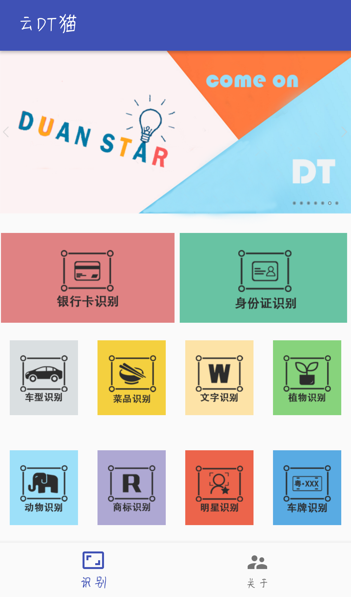{:height="30%" width="30%"}

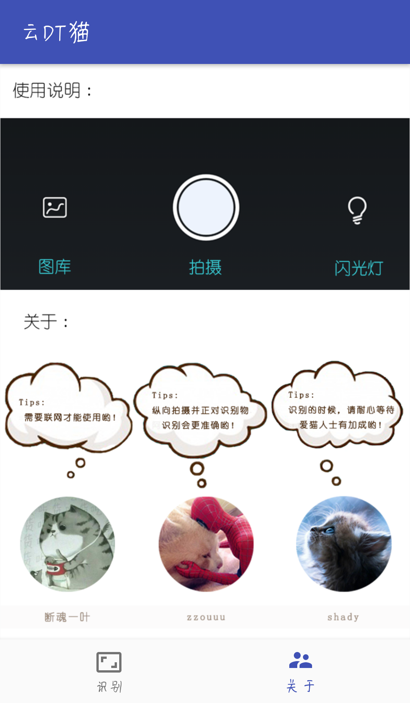{:height="30%" width="30%"}

#### 银行卡识别
{:height="30%" width="30%"}

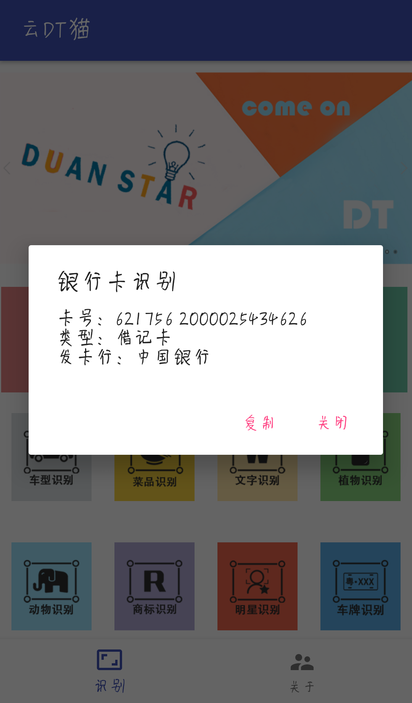{:height="30%" width="30%"}

#### 身份证识别
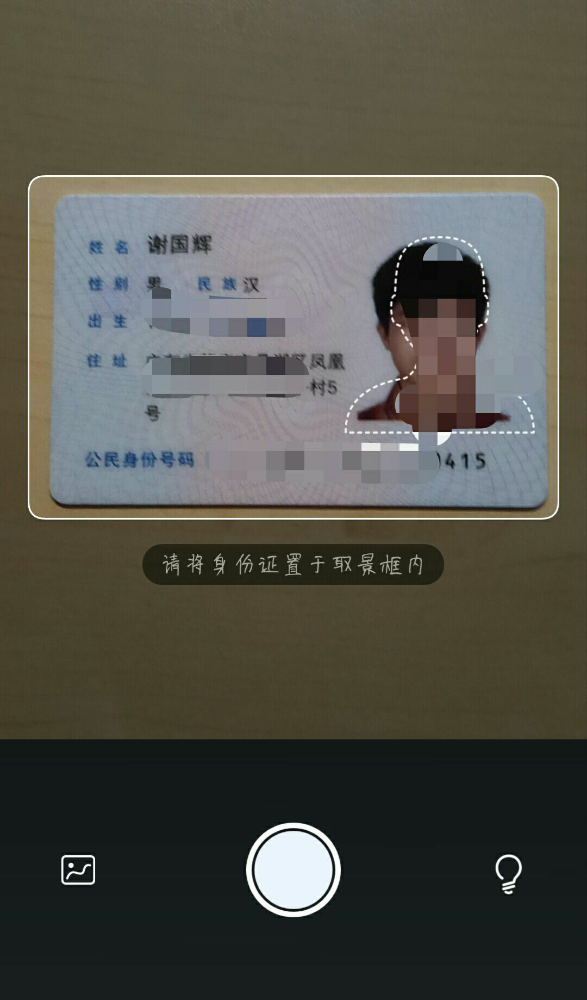{:height="30%" width="30%"}

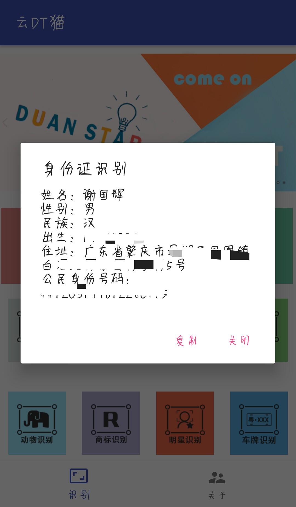{:height="30%" width="30%"}

#### 车型识别
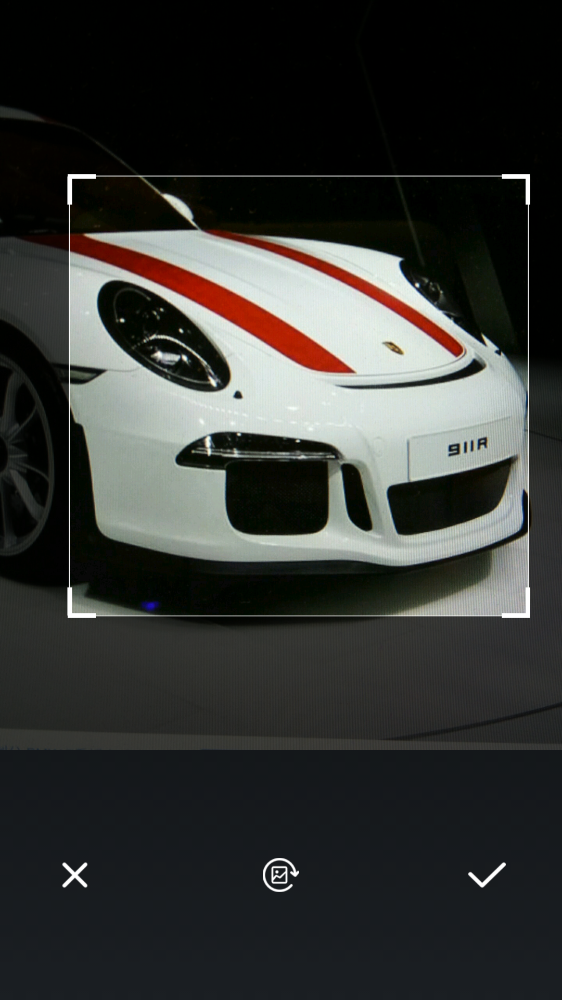{:height="30%" width="30%"}

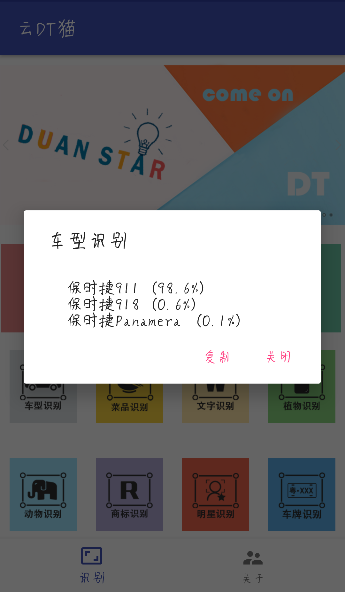{:height="30%" width="30%"}

#### 菜品识别
{:height="30%" width="30%"}

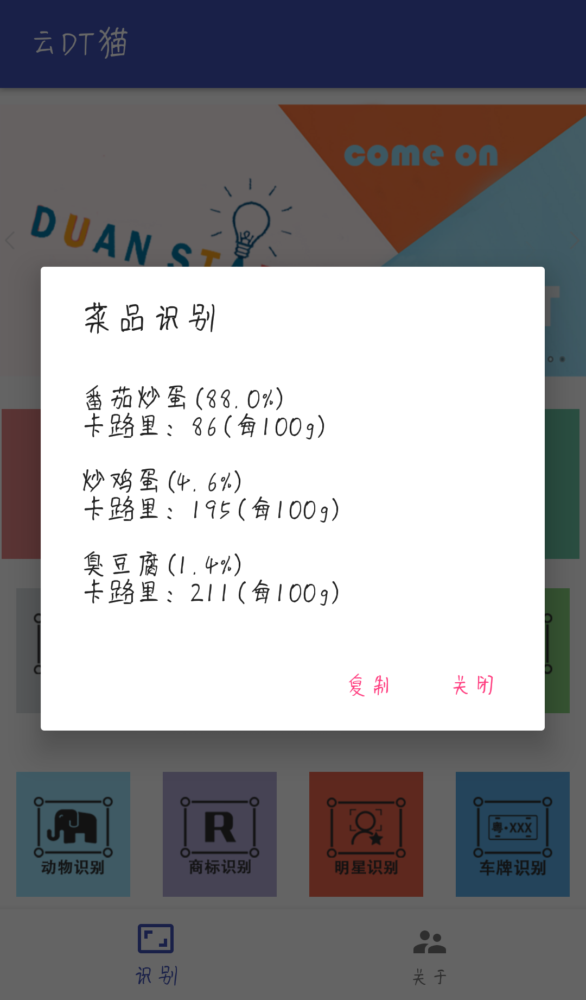{:height="30%" width="30%"}

#### 文字识别
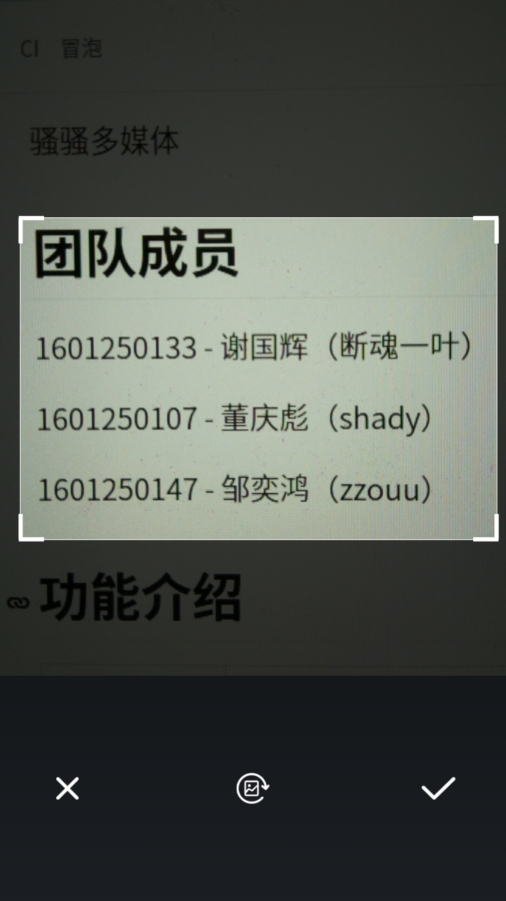{:height="30%" width="30%"}

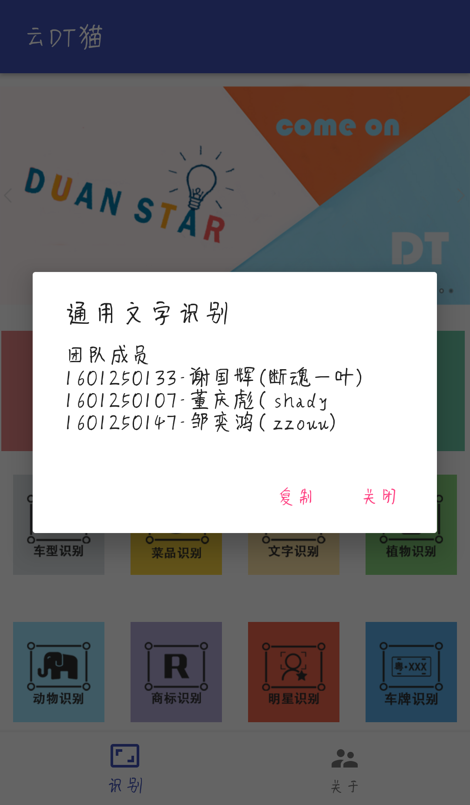{:height="30%" width="30%"}

#### 植物识别
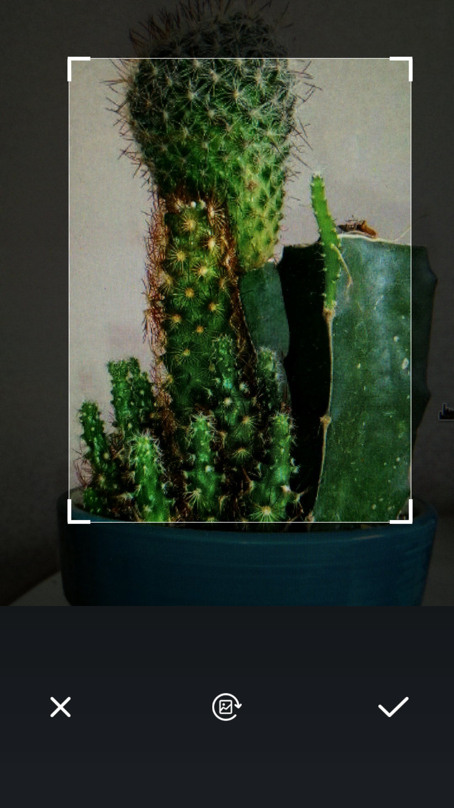{:height="30%" width="30%"}

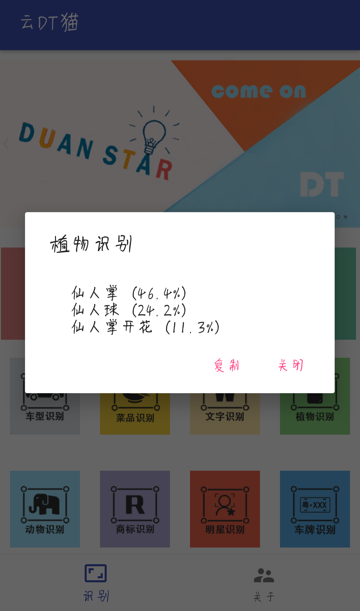{:height="30%" width="30%"}

#### 动物识别
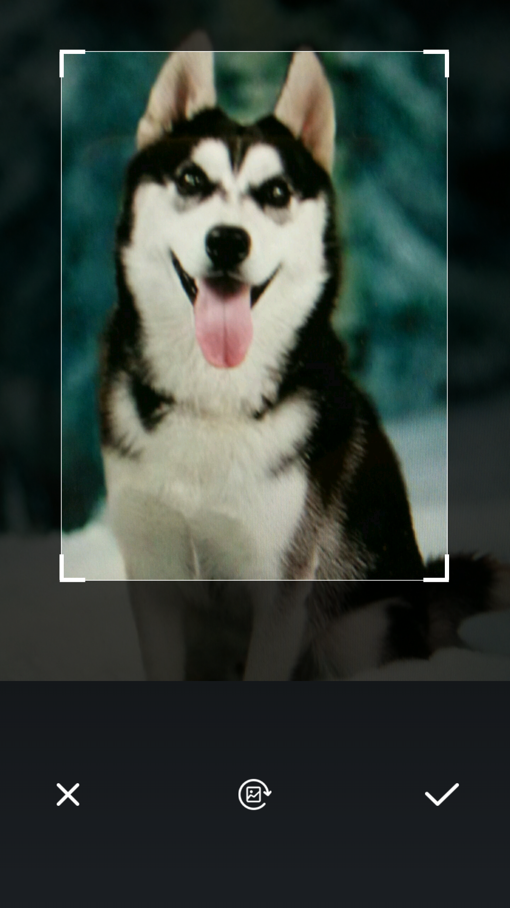{:height="30%" width="30%"}

{:height="30%" width="30%"}

#### 商标识别
{:height="30%" width="30%"}

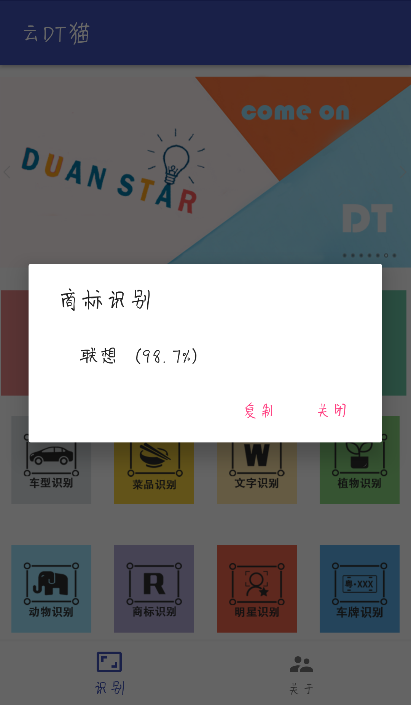{:height="30%" width="30%"}

#### 车牌识别
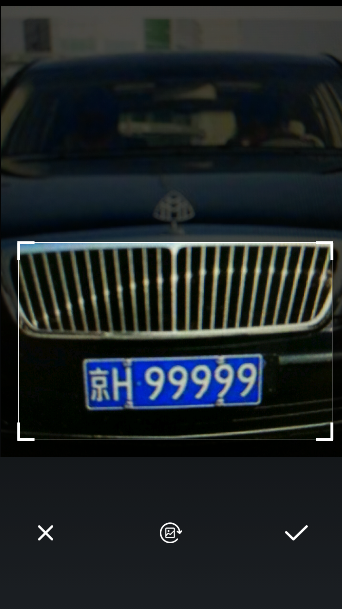{:height="30%" width="30%"}

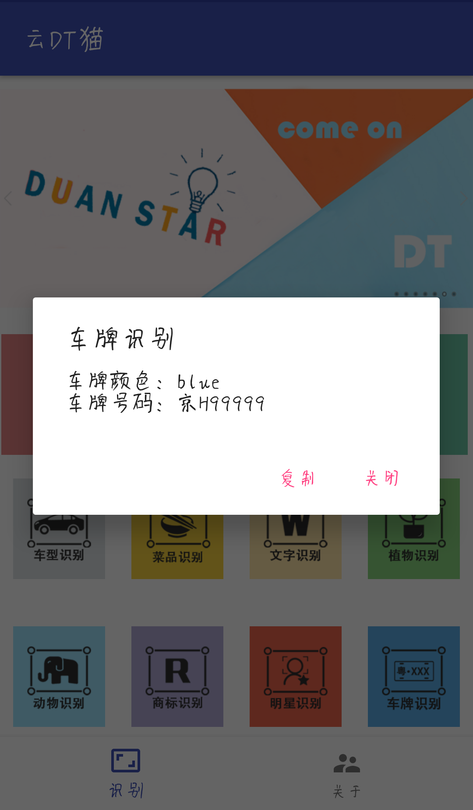{:height="30%" width="30%"}

#### 打包APP链接：
https://pan.baidu.com/s/1qYV2zJu    "云DT猫"

## 部署说明
- 开发工具 ：Android Studio 3.0 
- 开发环境 ：win10
- 提交系统 ：deepin(深度Linux) 